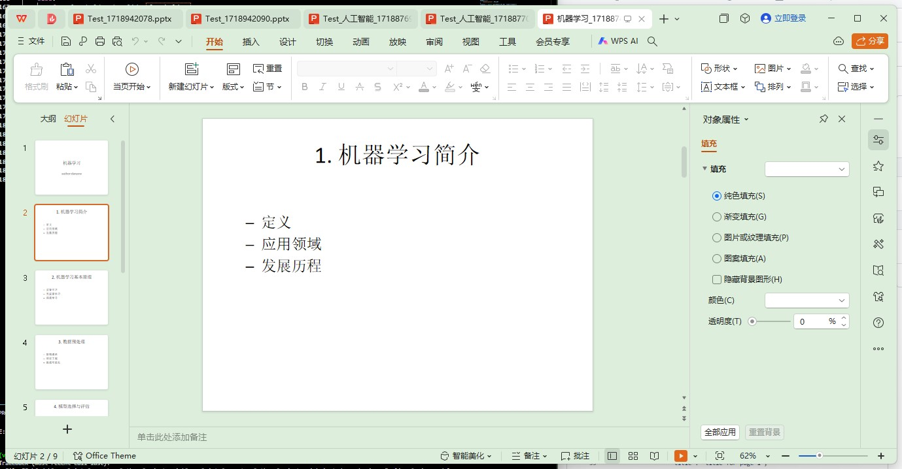
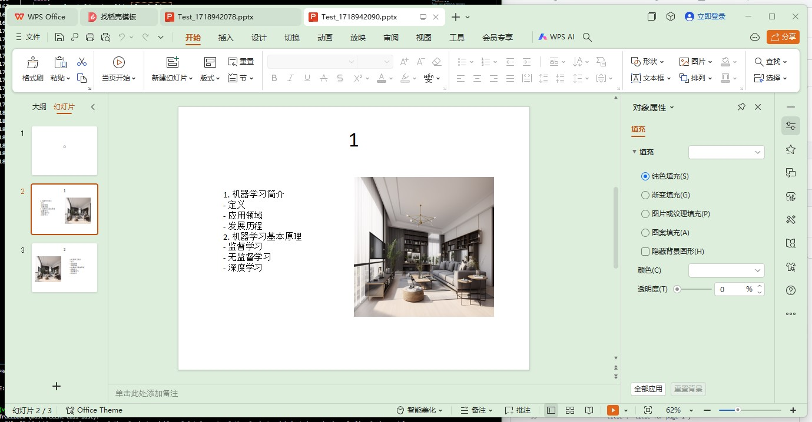

# ppt by LLM 
使用LLM的oneapi接口来实现简单的ppt生产工具

## features
1. 简单的ppt输出
2. 背景ppt替换
3. ppt的左右文字分界

## 参考项目
1. https://github.com/otahina/PowerPoint-Generator-Python-Project
2. https://github.com/owenliang/aippt
