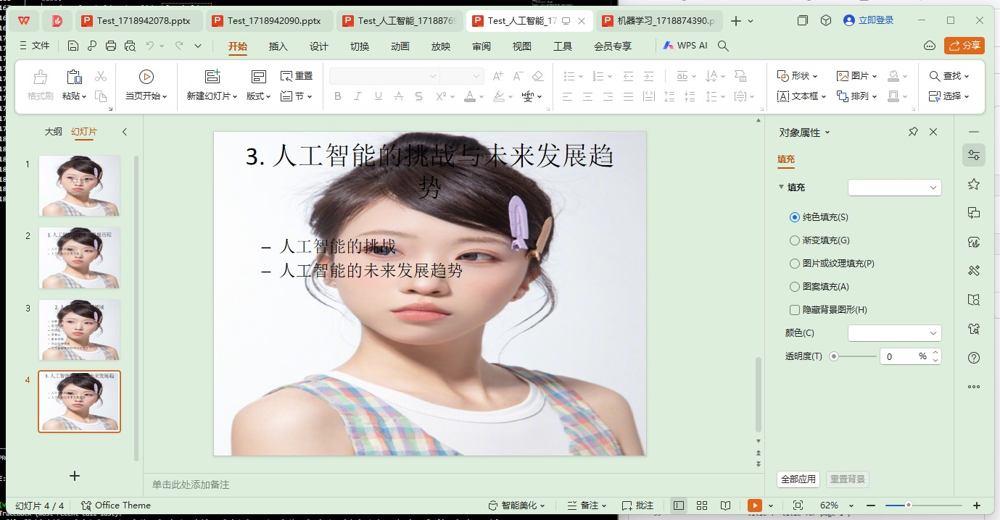

# ppt by LLM 
使用LLM的oneapi接口来实现简单的ppt生产工具

## features
1. 简单的ppt输出
2. 背景ppt替换
3. ppt的左右文字分界

## todo
1. 文字图片自动识别并进行排版
    使用`chinese_clip`来进行图文匹配
2. 复杂文档自动总结和概括
    使用最简单的词向量的余弦相似度来作为标准
    

## 参考项目
1. https://github.com/otahina/PowerPoint-Generator-Python-Project
2. https://github.com/owenliang/aippt
